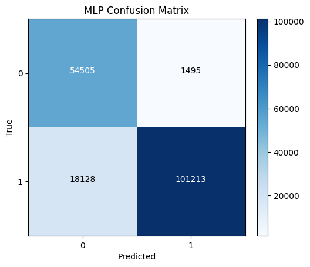
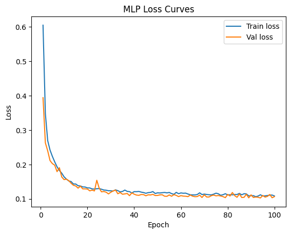
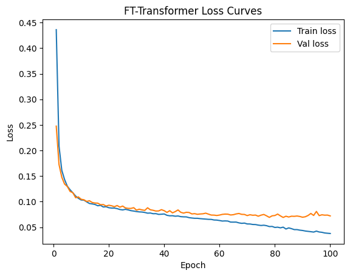
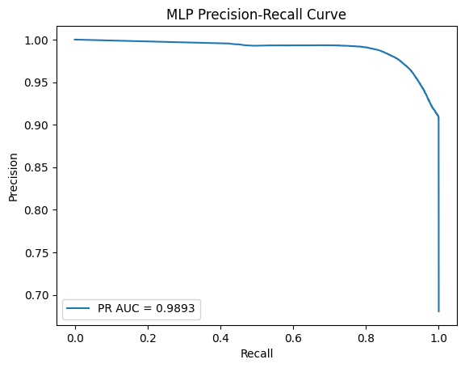
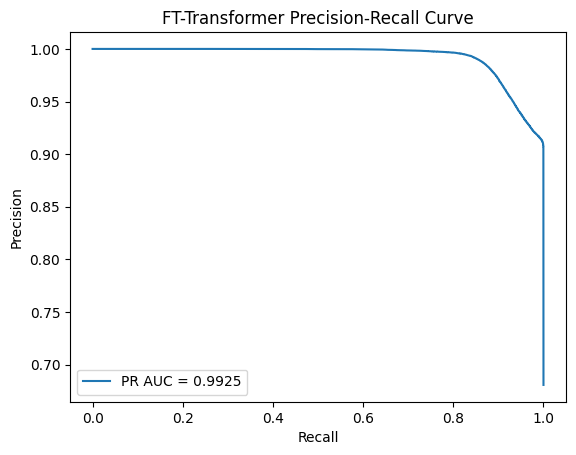
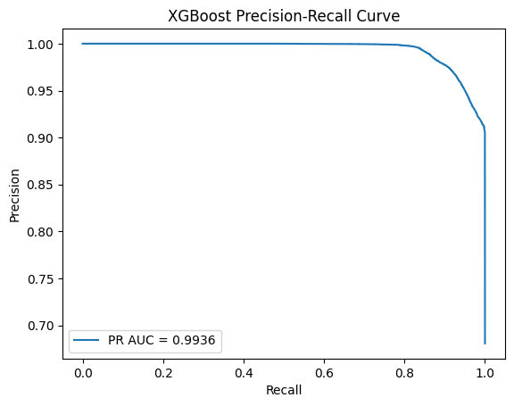
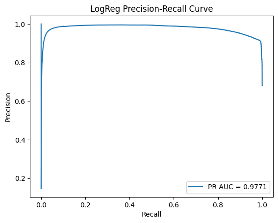

# 👉 Folder Structure
```
CSI4460/
│
├── Datasets/UNSW                       #Dataset file needs
│   ├── UNSW_NB15_training-set.csv
│   ├── UNSW_NB15_testing-set.csv
├── data_loader.py                # Load & preprocess UNSW
│
├── models/                       # All ML / DL models
│   ├── ft_transformer.py
│   ├── tabnet.py
│   ├── mlp.py
│   ├── logistic_regression.py
│
├── results/                      # Saved outputs & checkpoints
│   ├── ftt/
│   ├── xgb/
│   ├── logreg/
│   ├── mlp/
├── utils/                      #  Metrics, plots, imbalance handling
│   ├── metrics.py
│   ├── plotting.py
│
├── train.py                      # Universal training loop (epochs, validation)
└── test.py                       # Entry point to run training/evaluation
```
# 👉 Dataset Download

We automatically detect:
* 39 numerical features
* 3 categorical features → proto, service, state
* binary label → label (0 = normal, 1 = attack)
* Download: [**Download the dataset from Kaggle (Website)**](https://www.kaggle.com/datasets/mrwellsdavid/unsw-nb15/data)
  

# 👉 Models Implemented
We evaluate four modern ML/DL models:

| Model              | Type                      | Notes                                      |
|--------------------|---------------------------|---------------------------------------------|
| Logistic Regression | Classical ML              | Strong baseline                             |
| XGBoost             | Gradient Boosted Trees    | Handles imbalance extremely well            |
| MLP                 | Deep Learning             | Learns complex non-linear patterns          |
| FT-Transformer      | Transformer for Tabular Data | State-of-the-art on heterogeneous features |

[**Download the trained model (Google Drive)**](https://drive.google.com/drive/folders/1Jcmix6MMokSTROgOl4w5VfRs67p8IkSN?usp=drive_link)
# 👉 Evaluation
## Experiment settings
We conducted all experiments using 1× NVIDIA RTX 4070 (16 GB) GPU. We train all the models on the UNSW-NB15 dataset as the primary dataset and evaluated on both validation and test splits.
This setup follows the problem statement and milestones defined in the project description.

## ⚙️ Training Parameters Summary

| Component / Model | Hyperparameters |
|------------------|-----------------|
| **Epochs** | 100 (configurable) |
| **Batch Size** | 512 |
| **Loss Function** | Binary Cross-Entropy (BCEWithLogits) |
| **Optimizer** | AdamW |
| **Learning Rate (DL Models)** | 0.001 |
| **Weight Decay** | 1e-4 |
| **Imbalance Handling** | pos_weight = (neg / pos) |
| **Train/Val Split** | 80% train / 20% validation |
| **Feature Scaling** | StandardScaler (numeric features) |
| **Categorical Encoding** | LabelEncoder (`proto`, `service`, `state`) |
| **Checkpointing** | Save **best model only** based on validation F1-score |
| **Plots Saved** | Loss Curve, ROC, PR Curve, Confusion Matrix |
| **Logistic Regression** | Solver=`lbfgs`, max_iter=10000, class_weight=`balanced` |
| **XGBoost** | n_estimators=300, max_depth=10, lr=**0.001**, subsample=0.8, colsample_bytree=0.8, objective=`binary:logistic`, scale_pos_weight=(neg/pos) |
| **MLP** | Hidden Layers: [256 → 128 → 64], Activation: ReLU, BatchNorm=True, Dropout=0.1 |
| **FT-Transformer** | d_model=128, n_heads=4/8, depth=4 blocks, ff_dim=512, dropout=0.1, lr=0.001, optimizer=AdamW |

## Results
### Results on Validation Data

| Model               | Accuracy     | Precision    | Recall       | F1 Score     |
|---------------------|--------------|--------------|--------------|--------------|
| Logistic Regression | 0.903        | 0.923        | 0.899        | 0.911     |
| XGBoost             | 0.963       |  0.958        |0.974       | 0.966        |
| MLP                 | 0.957   |0.967        |  0.954        |0.961        |
| FT-Transformer      |0.975   | 0.985        | 0.970        |0.977        |
### Results on Test Data

| Model               | Accuracy     | Precision    | Recall       | F1 Score     |
|---------------------|--------------|--------------|--------------|--------------|
| Logistic Regression | 0.856        | .972        | 0.811        | 0.885      |
| XGBoost             | 0.906        | 0.983        |0.877        | 0.927        |
| MLP                 | 0.888   |0.985        | 0.848        |0.911        |
| FT-Transformer      | 0.896   |0.989        | 0.857        | 0.918        |

Exact values are saved in each model’s `metrics.txt`.

### Confusion Matrix

<table>
  <tr>
    <td align="center">
      
      <br><b>MLP</b>
    </td>
    <td align="center">
      
      <br><b>FT-Transformer</b>
    </td>
  </tr>
  <tr>
    <td align="center">
      
      <br><b>XGBoost</b>
    </td>
    <td align="center">
      
      <br><b>Logistic Regression</b>
    </td>
  </tr>
</table>

### Training & Validation Loss

<table>
  <tr>
    <td align="center">
      
      <br><b>MLP</b>
    </td>
    <td align="center">
      
      <br><b>FT-Transformer</b>
    </td>
  </tr>
</table>

### PR Curve

<table>
  <tr>
    <td align="center">
      
      <br><b>MLP</b>
    </td>
    <td align="center">
      
      <br><b>FT-Transformer</b>
    </td>
  </tr>
  <tr>
    <td align="center">
      
      <br><b>XGBoost</b>
    </td>
    <td align="center">
      
      <br><b>Logistic Regression</b>
    </td>
  </tr>
</table>

# 👉 How to Run
## Training
```bash
python train.py --data_dir "D:/CSI4460/Datasets/UNSW" --model logreg
python train.py --data_dir "D:/CSI4460/Datasets/UNSW" --model xgb
python train.py --data_dir  "D:/CSI4460/Datasets/UNSW" --out_dir "D:/CSI4460/results" --model mlp --epochs 100 --batch_size 512
python train.py --data_dir "D:/CSI4460/Datasets/UNSW" --out_dir "D:/CSI4460/results"   --model ftt --epochs 100 --batch_size 512
```
## Testing
```bash
python test.py --model logreg --model_path results/logreg/logreg_best.pkl --data_dir Datasets/UNSW
python test.py --model xgb --model_path results/xgb/xgboost_best.json --data_dir Datasets/UNSW
python test.py --model mlp --model_path results/mlp/mlp_best.pt --data_dir Datasets/UNSW
python test.py --model ftt --model_path results/ftt/ftt_best.pt --data_dir Datasets/UNSW
```


